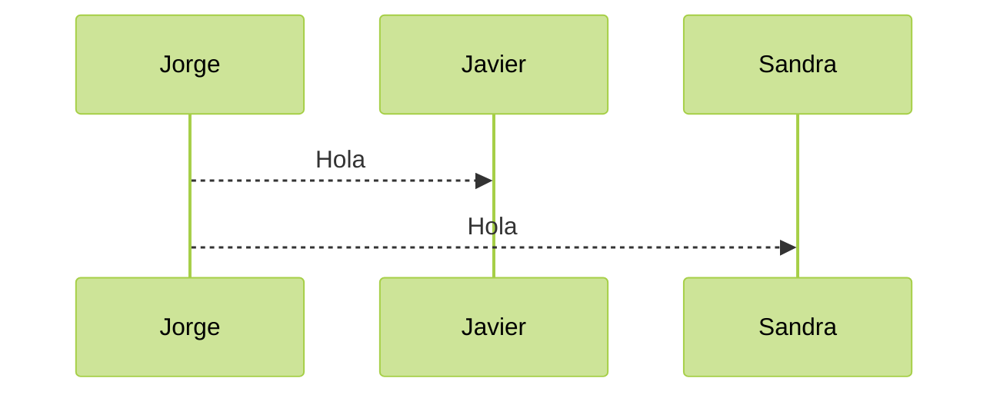

# test-DaC
Testing diagram as code fucntionality in github markdown

```mermaid
%%{init: {'theme': 'forest', "flowchart" : { "curve" : "basis" } } }%%
sequenceDiagram
    Jorge-->>Javier: Hola
    Jorge-->>Sandra: Hola
```
